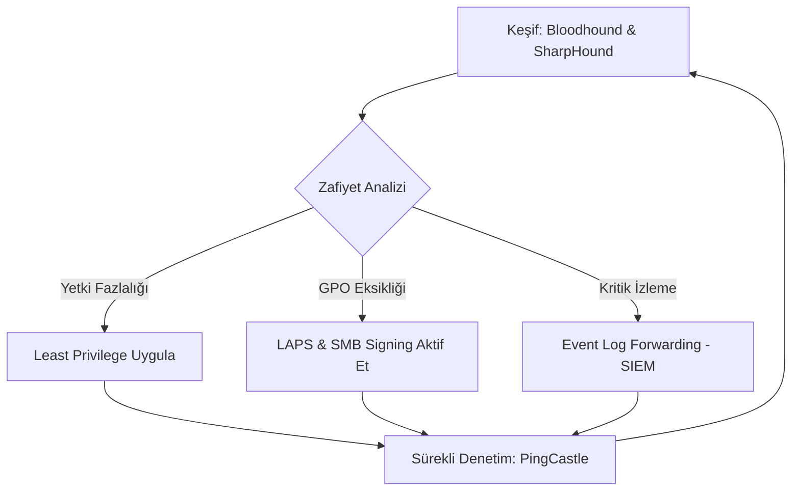

Merhaba, **Active Directory (AD) Hardening ve Auditing** üzerine hazırladığın bu proje hem kariyerin hem de siber güvenlik disiplini için oldukça kritik bir konu. Bir Bilişim Güvenliği Teknolojisi öğrencisi olarak akademik standartlara uygun, derinlemesine teknik detay içeren ve uygulamaya yönelik bir rapor hazırladım.

---

## 1. Giriş

Active Directory, kurumsal ağların kalbi olmasının yanı sıra saldırganların "Privilege Escalation" (Yetki Yükseltme) ve "Lateral Movement" (Yanal Hareket) için hedeflediği ana noktadır. AD Hardening, sadece şifre politikalarını değiştirmek değil, aynı zamanda güvenli delegasyon, katmanlı yönetim (Tiered Model) ve sürekli denetim (Auditing) süreçlerinin birleşimidir. Bu rapor, modern araçlar ve otomasyon teknikleriyle AD güvenliğini nasıl üst seviyeye çıkaracağınızı analiz eder.

---

## 2. Teknik Detaylar

### A. Bloodhound Entegrasyonu ve Graph Theory

Bloodhound, AD ortamındaki karmaşık yetki ilişkilerini analiz etmek için **Graph Theory** kullanır.

* **Analiz:** Saldırganların gözüyle "Domain Admin"e giden en kısa yolu (Shortest Path) bulmanızı sağlar.
* **Savunma (Hardening):** Bloodhound çıktılarını kullanarak "Geri Dönüşü Olmayan Yetki Devirlerini" (Dangerous Permissions) tespit edip temizlemek, saldırı yüzeyini %80'e varan oranlarda daraltır.

### B. GPO Analizi ve Sıkılaştırma

Grup İlkeleri (GPO), tüm ağın güvenlik konfigürasyonunu belirler.

* **LAPS (Local Administrator Password Solution):** Her bilgisayar için benzersiz yerel yönetici şifreleri oluşturulmalıdır.
* **SMB Signing:** Röle saldırılarını (Relay Attacks) önlemek için zorunlu tutulmalıdır.
* **PowerShell Logging:** Event ID 4104 (Script Block Logging) aktif edilerek saldırganların kod yürütme faaliyetleri izlenmelidir.

### C. Yetki Denetimi ve Tiered Administration (Katmanlı Model)

Microsoft'un önerdiği **Tier Administration Model**, kimlik avı saldırılarının etkisini izole eder:

* **Tier 0:** Domain Controller'lar ve Domain Admin hesapları (Sadece bu katmanda oturum açabilirler).
* **Tier 1:** Sunucular ve uygulama yönetimi.
* **Tier 2:** Son kullanıcı bilgisayarları ve standart kullanıcılar.

### D. Otomatik İyileştirme (Automated Remediation)

Sürekli denetim için **PowerShell Desired State Configuration (DSC)** veya **Ansible** gibi araçlarla konfigürasyon sapmalarını (Configuration Drift) otomatik olarak düzelten sistemler kurulmalıdır.

---

## 3. Infographic Tasarımı (Mermaid)

Aşağıdaki şema, bir AD sıkılaştırma döngüsünün nasıl işlemesi gerektiğini görselleştirmektedir:



---

## 4. Kod Örnekleri

### GPO Güvenlik Denetimi (PowerShell)

Aşağıdaki script, domain üzerindeki "Unquoted Service Path" zafiyetlerini (ayrıcalık yükseltme için kullanılır) tarayan temel bir auditing örneğidir:

```powershell
# Servis yollarını kontrol et ve tırnak içine alınmamış yolları bul
Get-WmiObject -Class Win32_Service | 
Where-Object {$_.PathName -notlike '"*' -and $_.PathName -like '* *' -and $_.PathName -notlike 'C:\Windows\*'} | 
Select-Object Name, PathName, DisplayName

```

### Modern HTML Sunum Sayfası

Bulgularını sunabileceğin, CSS içeren profesyonel bir dashboard taslağı:

```html
<!DOCTYPE html>
<html lang="tr">
<head>
    <meta charset="UTF-8">
    <title>AD Hardening Dashboard</title>
    <style>
        body { font-family: 'Segoe UI', sans-serif; background: #f4f7f6; color: #333; margin: 0; padding: 20px; }
        .container { max-width: 1000px; margin: auto; background: white; padding: 30px; border-radius: 8px; box-shadow: 0 4px 15px rgba(0,0,0,0.1); }
        h1 { color: #2c3e50; border-bottom: 2px solid #3498db; padding-bottom: 10px; }
        .metric-grid { display: grid; grid-template-columns: repeat(3, 1fr); gap: 20px; margin: 20px 0; }
        .metric-card { background: #3498db; color: white; padding: 20px; border-radius: 5px; text-align: center; }
        .status-high { color: #e74c3c; font-weight: bold; }
        .status-good { color: #27ae60; font-weight: bold; }
        table { width: 100%; border-collapse: collapse; margin-top: 20px; }
        th, td { padding: 12px; border: 1px solid #ddd; text-align: left; }
        th { background: #ecf0f1; }
    </style>
</head>
<body>
    <div class="container">
        <h1>AD Güvenlik Denetim Raporu</h1>
        <div class="metric-grid">
            <div class="metric-card"><h3>Domain Admin</h3><span>12 (Riskli)</span></div>
            <div class="metric-card" style="background:#2ecc71"><h3>GPO Uyumluluk</h3><span>%94</span></div>
            <div class="metric-card" style="background:#f1c40f"><h3>Açık Zafiyetler</h3><span>4 Orta</span></div>
        </div>
        
        <h2>Kritik Bulgular ve Aksiyonlar</h2>
        <table>
            <tr><th>Kategori</th><th>Bulgu</th><th>Durum</th><th>Önerilen İşlem</th></tr>
            <tr><td>Kan Grubu</td><td>Bloodhound Path</td><td class="status-high">KRİTİK</td><td>Privileged Accounts temizliği</td></tr>
            <tr><td>GPO</td><td>SMB Signing</td><td class="status-good">GÜVENLİ</td><td>N/A</td></tr>
            <tr><td>Identity</td><td>LAPS Kullanımı</td><td class="status-high">EKSİK</td><td>GPO üzerinden dağıtılmalı</td></tr>
        </table>
    </div>
</body>
</html>

```

---

## 5. Sonuç

Active Directory güvenliği, bir kez yapılıp bırakılan bir işlem değil, yaşayan bir süreçtir. **Bloodhound** gibi araçlarla yapılan düzenli grafik analizleri, **GPO** sıkılaştırması ve **otomatik auditing** mekanizmaları, kurumun siber dayanıklılığını artırır. Projenizde bu üç sacayağını (Analiz, Uygulama, İzleme) vurgulamanız akademik başarı için kritik önem taşımaktadır.

---

## 6. Kaynak Listesi

* **Microsoft Learn:** *Active Directory Security Best Practices* (2025 Güncellemesi)
* **SpecterOps:** *Bloodhound Documentation and Attack Path Management*
* **CIS Benchmarks:** *CIS Microsoft Windows Server 2022 Benchmark v3.0.0*
* **GitHub:** *PingCastle - Active Directory Security Auditing Tool*
* **OWASP:** *Internal Network Penetration Testing Guide*

---
## 🔗 Bağlantılı Dökümanlar
* **[Kaynaklar ve Referanslar](./research.gemini-fast.sources.md)** 
* **[Kullanılan Strateji Promptu](./research.gemini-fast.prompt.md)**